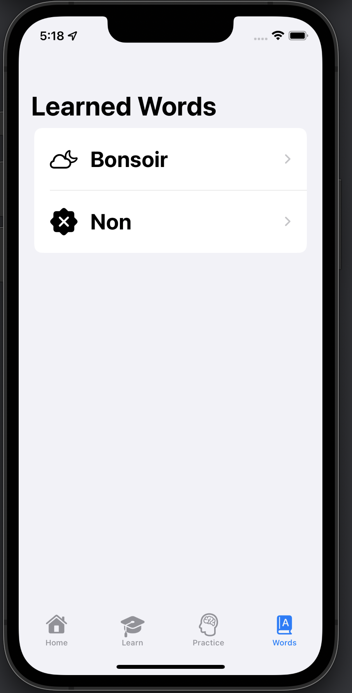

# Avec Moi (*english: with me*)

## Context
A multiplatform (macOS, iOS, watchOS) SwiftUI app submitted to SwiftUI Jam 2021.

## Description
I'm currently learning French in my spare time and finding it to be a difficult task. Especially if you're unable to read/speak/listen from people around you. That is why I wanted to created Avec Moi, a personal French buddy that will teach me new French words as well as quiz me from time to time. Avec Moi is built using SwiftUI, which makes it easy to make beautiful UI as well as to expand to multi-platform (macOS, iOS and watchOS). Regardless of where I am, I can use Avec Moi on my Apple Watch (while working out), on my iPhone (when I'm on the go or waiting for something) or on my MacBook Pro (during work or in the evenings).

## Technologies
- SwiftUI
- Swift
- XCode 13
- Core Data (to save learned words into local database)
- Lottie package via SPM (for animations)
- Custom font (Itim-Regular)

## Screenshot
### Final

### iOS

### macOS

### watchOS

